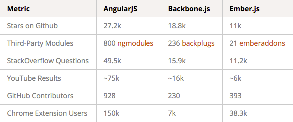

<!--

WARNING!! DON'T EDIT THE FILE README.md on the root of the project, that one is a GENERATED FILE!

You should just edit the source file at src/README.md - the one which stars with ## Treinamento Angular JS (parte 1)

-->

## Treinamento Angular JS (parte 1)


&nbsp;
&nbsp;

Victor Mauricio Gomes

*victor.gomes@h2h.com.br*

9 de setembro de 2015

---

## Agenda

- Escolha do framework
- Exemplo simplificado (ng directives)
- AngularJS e seu two-ways data-binding
- Trabalhando com Controllers
- Trabalhando com Servi&ccedil;os e Promises
- Trabalhando com Filtros no ng-repeat
- Trabalhando com Filtros no controller
- Refer&ecirc;ncias

---

## Escolha do framework



---

## Exemplo simplificado
#### (ng directives)

```
<div ng-app ng-init="show = 'hello'">
    <div ng-show="show == 'hello'">
        <h1>Hello World</h1>
    </div>
    <div ng-show="show == 'song'">
        <h1>I saw you say let say let saw...</h1>
        <p>I feel good because you put your but on me</p>
    </div>
    <button type="button" ng-click="show = 'hello'"
        ng-class="{'active': show == 'hello'}">Show Hello</button>
    <button type="button" ng-click="show = 'song'"
        ng-class="{'active': show == 'song'}">Sing me a song</button>
</div>
```

[JSFiddle](https://jsfiddle.net/5a3on5xg)

---

## AngularJS e seu two-ways data-binding

No Angular tudo oque &eacute; declarado como ***$scope*** no controller fica dispon&iacute;vel para a ***view em html*** e para as ***ng-directives***, tornando assim f&aacute;cil de manipular e ser&atilde;o exibidas no template atrav&eacute;s dos mustaches ***{{}}***

Assim uma altera&ccedil;&atilde;o de vari&aacute;vel no controller reflete automaticamente na view e vice-versa.

---

## Trabalhando com Controllers

```
var app = angular.module("myApp", []);

app.controller("listaDeParentes", ["$scope", function($scope){

    $scope.parentes = [{ nome: '', email: '' }];

    $scope.addParente = function() {
        $scope.parentes.push({ nome: '', email: '' });
    };

    $scope.sendForm = function() {
        alert("Pediu pra enviar, enviou!");
    };

}]);
```

[JSFiddle](https://jsfiddle.net/owdmweb2/1/)

----

#### (HTML utilizando o controller)

```
<div ng-app="myApp">
    <div ng-controller="listaDeParentes">
        <form ng-submit="sendForm()">
            <div>
                <div ng-repeat="parente in parentes track by $index">
                    <label>Nome:</label>
                    <input type="text" ng-model="parente.nome" />
                    <br/>
                    <label>E-mail:</label>
                    <input type="text" ng-model="parente.email" />
                </div>
                <button type="button" ng-click="addParente()">Adicionar parente</button>
            </div>
            <br/>
            <button type="submit">Compartlhar com meus parentes</button>
            <br/>
            <button type="button">Compartilhar no Facebook</button>
        </form>
    </div>
</div>
```

[JSFiddle](https://jsfiddle.net/owdmweb2/1/)

---

## Trabalhando com Servi&ccedil;os e Promises

```
var app = angular.module("myApp", []);

app.controller("recomendadosCtrl", ["$scope", "recomendadosSrv", function($scope, recomendadosSrv){
    recomendadosSrv.list().then(function(result){
        $scope.recomendados = result;
    });
}]);

app.service('recomendadosSrv', ['$http', '$log', '$q', function($http, $log, $q) {

    var produtos = [{name: 'produto 1'}, {name: 'produto 2'}, {name: 'produto 3'}];
    var deferred = $q.defer();
    var list = function(){
        // Utiliza o cache se existir
        if(produtos.length > 0) {
            deferred.resolve(produtos);
        }
        // Request
        $http.get('/widget/divulgador/getListaRecomendacoes/'+produtos.length).success(function(response) {
            produtos = response;
            deferred.resolve(response);
        }).error(function(data, status, headers, config){
            $log.error("Issue with service recomendadosSrv list", data, status, headers, config);
        });
        return deferred.promise
    };

    return { list: list };

}]);
```

[JSFiddle](https://jsfiddle.net/6d9zajba/)

----

## Trabalhando com Servi&ccedil;os e Promises
#### view (html)

```
<div ng-app="myApp">
    <div ng-controller="recomendadosCtrl">
        <div ng-hide="recomendados">
            Loading
        </div>
        <ul ng-show="recomendados">
            <li ng-repeat="produto in recomendados track by $index">
                {{produto.name}}
            </li>
        </ul>
    </div>
</div>
```

[JSFiddle](https://jsfiddle.net/6d9zajba/)

---

## Trabalhando com Filtros no ng-repeat

```
<div ng-app ng-init="colaboradores = [{name:'Victor Mauricio Gomes'}, {name:'Wiliam Omori'}, {name:'Eduardo Pintor'}, {name:'Fernando Oliveira'}, {name:'William Marcondes'}, {name:'Cesar Froes'}, {name:'Jaques Weltman'}]">
    <input type="text" ng-model="filtro"/>

    <ul>
        <li ng-repeat="colaborador in colaboradores | orderBy: 'name' | filter:filtro">
            {{colaborador.name}}
        </li>
    </ul>
</div>
```

Estamos utilizando dois filtros aqui, um de ***order by*** e outro de ***filter***, poderiamos utilizar o filtro ***limit*** tamb&eacute;m, por exemplo

[JSFiddle](https://jsfiddle.net/0hqqvpu7/)

---

## Trabalhando com Filtros no controller

```
var app = angular.module("myApp", []);

app.controller("itemCtrl", ["$scope", "$filter", function($scope, $filter){
    var perPage = 5
      , lista = [
            { name: 'item 1' }, { name: 'item 2' }, { name: 'item 3' },
            { name: 'item 4' }, { name: 'item 5' }, { name: 'item 6' },
            { name: 'item 7' }, { name: 'item 8' }, { name: 'item 9' },
            { name: 'item 10' }, { name: 'item 11' }, { name: 'item 12' }
        ];

    $scope.lista = $filter('limitTo')(lista, perPage, 0);

    $scope.paginar = function(pagina){
        var begin = (perPage * pagina) - perPage;
        $scope.lista = $filter('limitTo')(lista, perPage, begin);
    };

}]);
```

[JSFiddle](https://jsfiddle.net/5hjef9me/1/)

----

## Trabalhando com Filtros no controller
#### view (html)

```
<div ng-app="myApp">
    <div ng-controller="itemCtrl">
        <ul>
            <li ng-repeat="item in lista">
                {{item.name}}
            </li>
        </ul>
        <button type="button" ng-click="paginar(1)">1</button>
        <button type="button" ng-click="paginar(2)">2</button>
        <button type="button" ng-click="paginar(3)">3</button>
    </div>
</div>
```

[JSFiddle](https://jsfiddle.net/5hjef9me/1/)


---

## Refer&ecirc;ncias

1. [AngularJS vs. Backbone.js vs. Ember.js](https://www.airpair.com/js/javascript-framework-comparison)
2. [Creating a CRUD App in Minutes with Angular's $resource](http://www.sitepoint.com/creating-crud-app-minutes-angulars-resource/)
3. [Benchmark errado entre AngularJS e ReactJS, usando o track by no ng-repeat para tunning](http://blog.500tech.com/is-reactjs-fast/)
4. [Esclarecendo alguns mitos sobre o AngularJS](https://medium.com/@cironunesdev/esclarecendo-alguns-mitos-sobre-o-angularjs-1643d4317e75)


